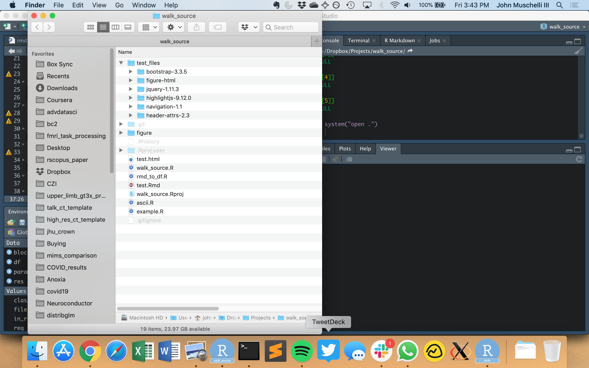

```{r setup, include=FALSE}
knitr::opts_chunk$set(echo = TRUE)
library(dplyr)
```

## Using data
Here we're going to manipulate some data using the `dpylr` R package.  Let's load the library:

```{r loadup}
library(dplyr)
```

We're going to be using the G g plot2 package.  We're going to load it up and then manipulate the diamonds data set.

```{r ggplot2}
library(ggplot2)
df = diamonds %>% 
  filter(carat > 1)
```

We're going to look at the plot:
```{r p}
qplot(x = price, data = df)
```

```{r, cache = TRUE}
qplot(x = carat, data = df)
```

```{r}

```

